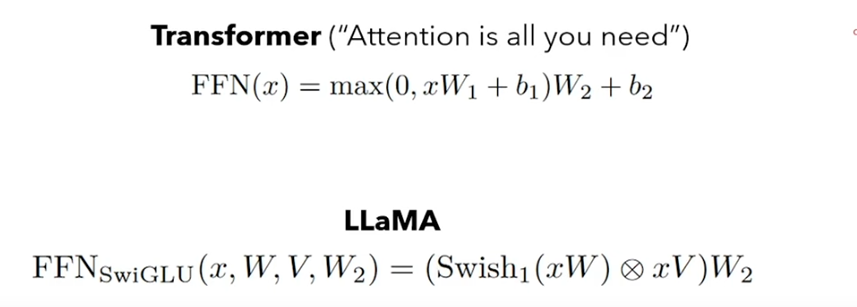

### Diagram

### Input Embedding
Original Sentence -> Input IDs -> Embeddings (of Size 4096)\\

- repeated 32 times

### RoPE

### KV-Cache
- in inference, we just need to know the last token, it will help computation as well.
- only put only val of Q with all vals of K to get one row of Q.K^T and then get only one val of attention 

### SwiGLU
